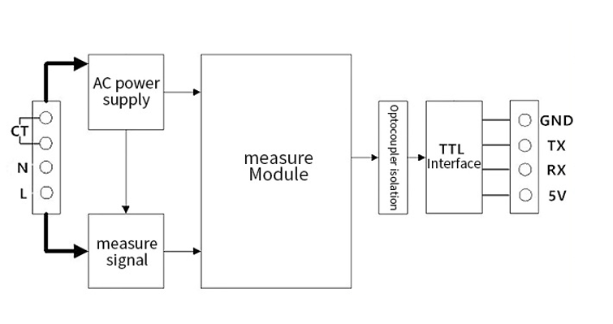
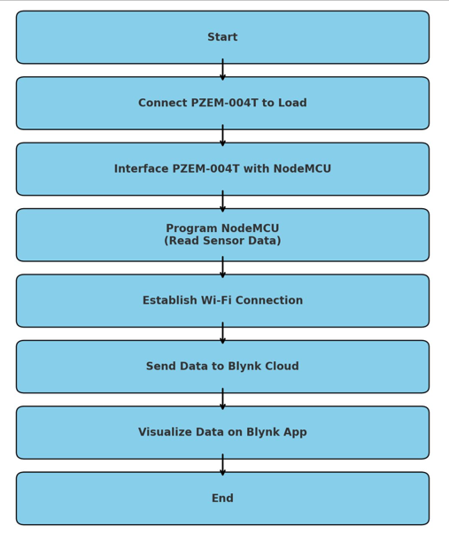
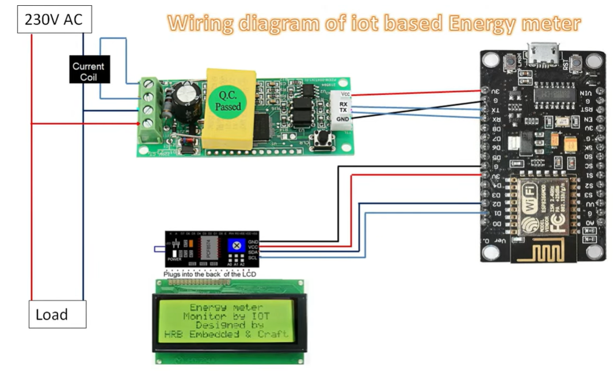
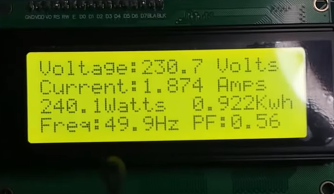
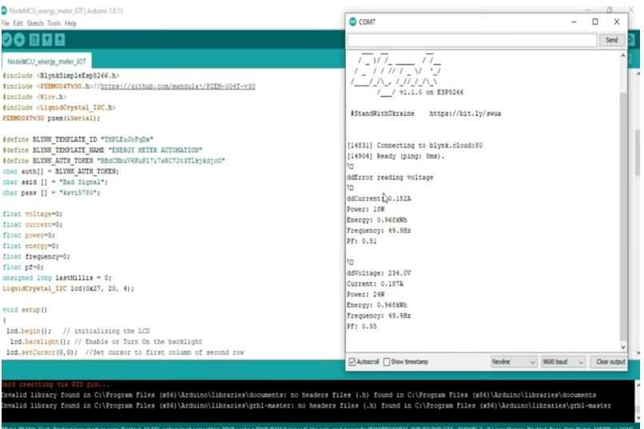

# Smart Electric Meter Monitoring System

## Project Overview
A smart system to monitor real-time energy consumption and transmit data wirelessly for efficient energy management.

---

## Block Diagram

  

---

## Flow Diagram

  

---

## System Architecture

  

---

## LED Output

  

---

## Final Output

  

---

## Features
- Real-time energy monitoring
- Wireless data transmission
- User-friendly visualization
- Efficient power management

---

## Applications
- Smart homes
- Energy billing systems
- Industrial monitoring
- IoT-based automation

---

## Technologies Used
- Microcontroller (Arduino/ESP)
- Sensors (Current & Voltage)
- Communication Module (Wi-Fi)
